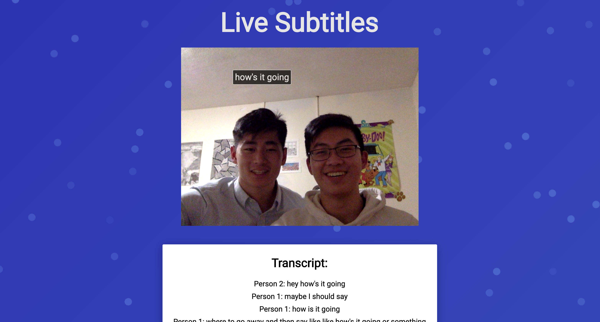
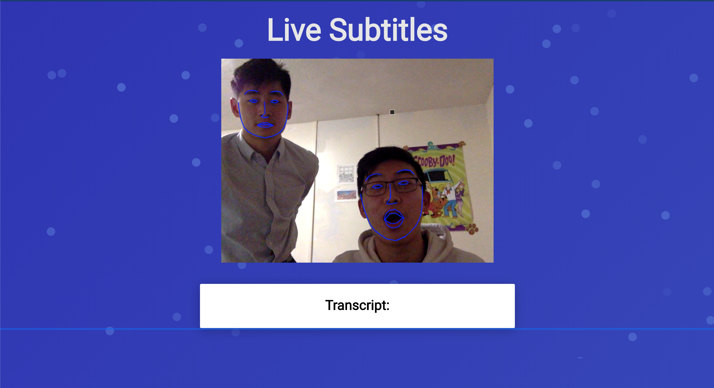

# Live Subtitles

> Display what people are saying as they are talking in real time!
> A quick app built by David Shen, Roger Wang, Jerry Han, and Alex Sun.
> Created using React, Tensorflow.js, and Chrome's speech-to-text API.

 

<!-- 
[See full video demonstration here](https://www.youtube.com/watch?v=J0t2Kvortio&feature=youtu.be) -->

<h1 align="center">
  <a href="https://live-subtitles.herokuapp.com">Try It Yourself</a>
</h1>

---

  

  <a href="https://www.youtube.com/watch?v=J0t2Kvortio&feature=youtu.be">See Full Video Demonstration!</a>

  

  

---

## Getting Started

- All the `code` required to get started
- Images of what it should look like

### Clone

- Clone this repo to your local machine
`git clone https://github.com/rogerwangcs/ar-dialogue-subtitles.git`

### Setup

##### Install dependencies
`yarn install` or `npm install`

##### Install dependencies
`yarn install` or `npm install`

### Run
`yarn start` or `npm npm start`

Enjoy!

---

## Contributors
- [Roger Wang](https://github.com/rogerwangcs)
- [David Shen](https://github.com/pantherman594)
- [Jerry Han](https://github.com/sparkyman173)
- [Alexander Sun](https://github.com/technoAl)

---
## License
- **[MIT license](http://opensource.org/licenses/mit-license.php)**